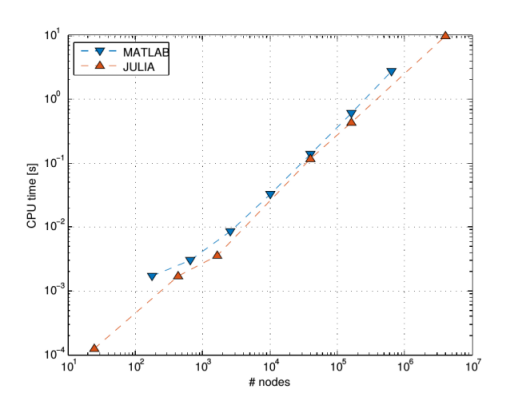
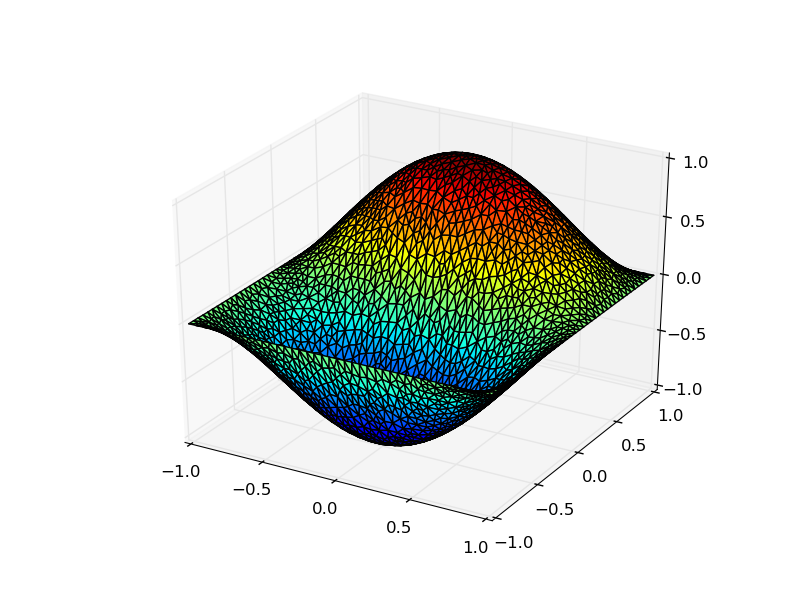

# EllipticFEM.jl &mdash; a FEM Solver for Elliptic Problems Written in Julia
------------------------------------------------------------------------

[](https://travis-ci.org/gerhardtulzer/EllipticFEM)

This package provides an implementation of a 2D finite-element method
for solving elliptic partial differential equations such as the
Poisson equation in Julia. In particular, one can solve

```
$ -\nabla (A \nabla u) = f $  in \Omega,

	               $ u = gD $ on \Gamma_D,
	               
      	    $ \nabla u = gN $ on \Gamma_N,
```

where \Omega is the domain, and \Gamma\_D and \Gamma\_N denote Dirichlet and
Neumann boundary, respectively.

It is possible to prescribe
* arbitrary Dirichlet and/or Neumann boundary conditions,
* an arbitrary right-hand side function, and
* a constant coefficient in the elliptic operator.


The user can provide a mesh generated by GMSH (www.gmsh.info) or
provide the mesh information in the composite type `mesh`.

An important feature of this implementation in Julia is that matrix
assembly is faster than in MATLAB (see Figure).



For plotting, the `PyPlot` package is needed.

# Functions
-----------

## read_mesh

* Input: Path to mesh file.
* Output: Composite type `mesh`.

`read_mesh` reads the GMSH file and creates a composite type `mesh`, which
contains all necessary information about the mesh.

`mesh` contains the following fields:
* `nodes`: 2 &times; nr_nodes array containing the node coordinates
* `edges`: 4 &times; nr_edges array. Lines 1 and 2: nodes forming the
	edge. Line 3: physical property. Line 4: geometrical property
	(defining the boundary condition).
* `elements`: 5 &times; nr_elements array.  Lines 1, 2, and 3: node indices forming the
	triangle. Line 4: physical property. Line 5: geometrical property.

The physical properties are currently not used as well as the
geometrical property of the elements. These quantities may be used to
define subdomains later.

## assemble

* Input: mesh `mesh`, ellipticity constant `A`, right-hand side
	function `f`, boundary data `bddata`.
* Output: stiffness matrix `M`, right-hand side vector `b`.

`assemble` takes the named input and provides the stiffness
matrix and right-hand side vector.  The input needs to be as follows:
* `mesh::mesh`.
* `A::Float64`: only constants are allowed.
* `f::Function`: a function of two arguments, e.g. `(x,y) -> x+y`
* `bddata::Array`: 3 &times; n Array, where n is the number of different
edge physical properties defined in the GMSH file. The first row needs
to contain the geometrical properties defined in the GMSH file, the second row
contains either `'D'` (for a Dirichlet boundary) or `'N'` (for a Neumann 
boundary) at the respective type of edge. The third row contains a function of 
two coordinates giving the value of the solution on the boundary,
e.g. `(x,y) -> 0` for homogeneous conditions.

## solve

* Input: path to meshfile, ellipticity constant `A`, right-hand side
	function `f`, boundary data `bddata`.
* Output: mesh, solution `u`.

`solve` combines `read_mesh` and and `assemble`, and
furthermore uses the backslash operator to calculate the solution `u`.

## plot_solution 

* Input: mesh, solution `u`.
* Output: 3D surface plot of the solution.

`plot_solution` plots the solution over the mesh.

## calculate_norm 

* Input: mesh, solution `u`.
* Output: 2-norm of the solution.

`calculate_norm` calculates the 2-norm of the solution using a first-order 
integration rule.

# An Example
------------------

The code and also the mesh file for this example are stored in the test folder.
Using `run_fem` is the most convenient way to obtain a solution:

First, the path of the mesh file, the coefficient `A`, the right hand side
function `f`, and the boundary data need to be prescribed.

```
meshpath = "mesh_p05.msh";
A = 1.0;
f = (x,y) -> 5/4*pi^2*cos(x*pi/2)*sin(y*pi);
bddata = [1 2 3 4;
		'D' 'N' 'D' 'N';
		(x,y)->0 (x,y)->-pi/2*sin(x*pi/2)*sin(y*pi) (x,y)->0 (x,y)->pi/2*sin(x*pi/2)*sin(y*pi)];
mesh, u = solve(meshpath, A, f, bddata);
```

Then the solution is plotted using `plot_solution`:

`plot_solution(mesh, u)`



The exact solution in this example is `cos(x*pi/2) * sin(y*pi)`.

The norm can be obtained via `calculate_norm`:

`calculate_norm(mesh,u)`


# Authors
---------

* Caroline Geiersbach
* Clemens Heitzinger (Clemens.Heitzinger@TUWien.ac.at, http://Clemens.Heitzinger.name)
* Gerhard Tulzer (Gerhard.Tulzer@TUWien.ac.at)
