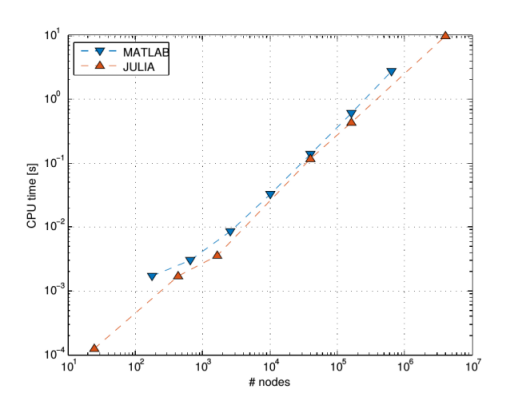
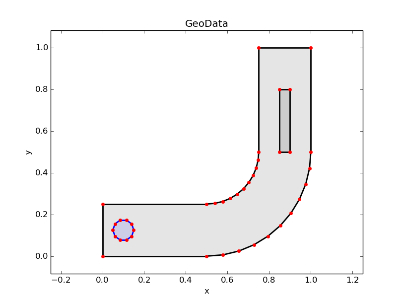
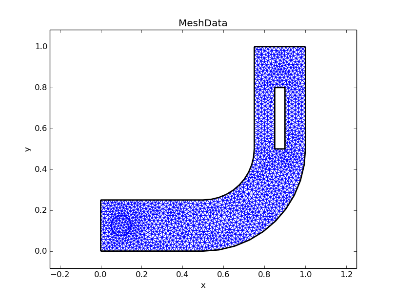
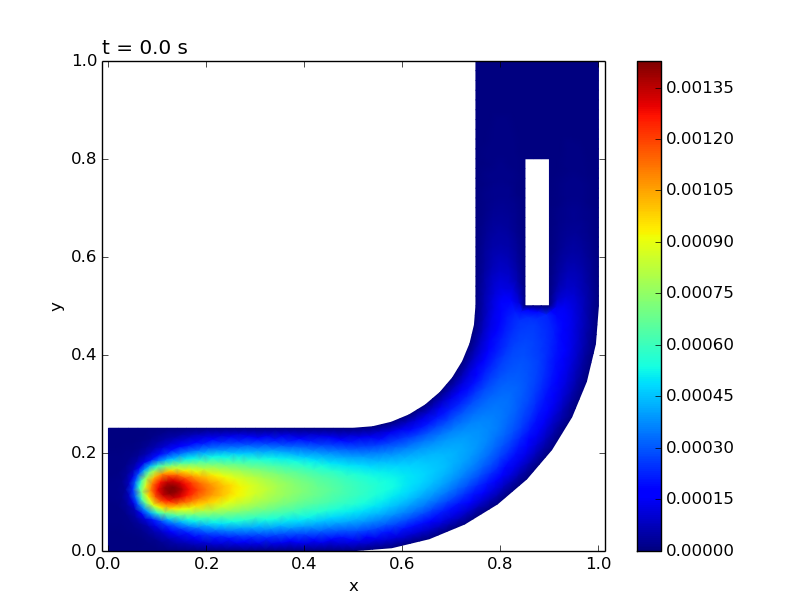

# EllipticFEM.jl &mdash; a FEM Solver for Elliptic, Parabolic and Hyperbolic PDEs Written in Julia
--------------------------------------------------------------------------------------------------

[](https://travis-ci.org/gerhardtulzer/EllipticFEM)

This package provides an implementation of a 2D finite element method
for solving elliptic, parabolic or hyperbolic partial differential equations in Julia. In particular, one can solve

```
$ (\partial_{t(t)} u) - \nabla (A*\nabla u) + b*\nabla u + c*u = f $  in $\Omega$,

														   $ u = g\_D $ on $\Gamma\_D$,

											  $ (A*\nabla u)*n = g\_N $ on $\Gamma\_N$,

      	    											   $ u = u $ on $\Gamma\_P$,
```

where $\Omega$ is the domain and $\Gamma\_D$, $\Gamma\_N$ and $\Gamma\_P$ denote Dirichlet,
Neumann and periodic boundary, respectively. The term $(\partial_{t(t)} u)$ can be either absent (elliptic equation),
or one of $\partial_t u$ (parabolic equation) or $\partial_{tt}$ u (hyperbolic equation).

It is possible to prescribe
* Very general domains $\Omega$ with holes and subdomains.
* Arbitrary coefficients $A,b,c,f$ depending on space and time (defined on each subdomain independently).
* Arbitrary Dirichlet, Neumann and/or periodic boundary conditions depending on space and time (defined on each part of the boundary independently).

# Comparison to MATLAB
----------------------

An important feature of this implementation in Julia is that the core matrix
assembly is faster than in MATLAB (see Figure).



# Requirements
--------------

You need:
* Tested with Julia version 0.4.5.
* `PyPlot` (Julia Package for plotting functions, https://github.com/stevengj/PyPlot.jl)
* `LightGraphs` (Julia Package for mathematical graphs, https://github.com/JuliaGraphs/LightGraphs.jl)
* `gmsh` (Open source meshing program, http://gmsh.info/)
* `avconv` (Open source frames-to-video-converter, https://libav.org/avconv.html)
* `vlc` (Open source video player, http://www.videolan.org/vlc/)

# How to get started
--------------------

The folder `Run` contains the subfolders `Elliptic`, `Homogenization`, `Parabolic` and `Hyperbolic`, each of which contains a runner file 
`runElliptic.jl`, `runHomogenization.jl`, `runParabolic.jl` or `runHyperbolic.jl`, respectively. Simply set your
working directory to the respective path, start Julia and enter `include("runElliptic.jl")` in the Julia REPL.

The output images/videos are stored in the `Saved images` folder.

# Important data types
----------------------

* type EquationData: Contains all the information about the problem the user wants to solve, i.e. the geometry of the domain including holes and subdomains, the coefficients A,b,c,f and the boundary conditions.
* type GeoData: Is an intermediate step between EquationData and MeshData. The boundaries of the domain, the holes and the subdomains are discretized and stored here. This type also handles the intersection points between intersecting subdomains. This type mimicks the data types used in gmsh, but adds some information to them.
* type MeshData: Contains all information about the triangular grid on the domain. The output of gmsh gets written into this data structure. Some additional geometric properties (e.g. the volume of each triangle) are computed and also stored here.
* type LSEData: Contains system matrix and load vector of the LSE occuring in the P1-FEM (i.e. piecewise linear Ansatz functions) for the aforementioned elliptic, parabolic or hyperbolic PDEs. The discrete solution(s) are stored here as well.

# An example (Elliptic equation)
--------------------------------

The file `runElliptic.jl` essentially contains the following Julia code:

```
equationData = equationDataAssemble("./ellipticEquationDataLPipe.jl")

geoData = equationDataToGeoData(equationData)
geoDataPlot(geoData)

intendedMeshsize = 0.02
meshData = geoDataToMeshData(geoData,intendedMeshsize)
meshDataPlot(meshData)

deltaT = 0.0
lseData = lseDataAssemble(equationData,meshData,deltaT)

lseDataSolve(equationData,meshData,lseData)

lseDataPlot(meshData,lseData)
```

* The function `equationDataAssemble(...)` reads the `equationData` from the file `./ellipticEquationDataLPipe.jl`. (You can edit this file to change the geometry of the domain or choose other coefficient functions $A,b,c,f,...$)
* The function `equationDataToGeoData(...)` discretizes the geometry defined in `equationData` and handles the intersection points between domain/holes/subdomains.
* The function `geoDataPlot(...)` plots the discretized geometry stored in `geoData`.
* The function `geoDataToMeshData(...)` runs gmsh on the discretized domain and stores the output in `meshData`.
* The function `meshDataPlot(...)` plots the triangular mesh generated by gmsh.
* The function `lseDataAssemble(...)` assembles the system matrix and the load vector of the LSE occuring in the FEM.
* The function `lseDataSolve(...)` solves the LSE defined in `lseData` and stores the solution(s) in `lseData`.
* The function `lseDataPlot(...)` plots the solution and eventually saves the resulting images/videos in the folder `Saved images`.





# Authors
---------

* Niklas Angleitner (Niklas.Angleitner@TUWien.ac.at)
* Caroline Geiersbach
* Clemens Heitzinger (Clemens.Heitzinger@TUWien.ac.at, http://Clemens.Heitzinger.name)
* Gerhard Tulzer (Gerhard.Tulzer@TUWien.ac.at)
